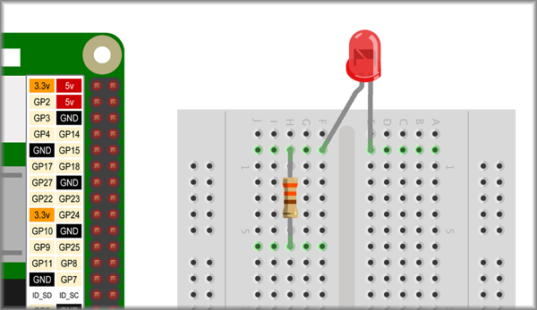
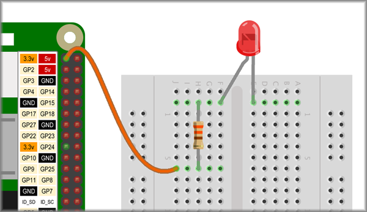

## Lighting an LED

One powerful feature of the Raspberry Pi is the rows of GPIO pins along the top edge of the board. GPIO stands for General-Purpose Input/Output. You can code these pins as switches that you can turn on or off (input) or that the Pi can turn on or off (output).

You can buy a [pin guide](https://thepihut.com/products/gpio-reference-board-model-b-plus-and-a-plus?ref=isp_rel_prd&isp_ref_pos=5){:target="_blank"} to help you identify the GPIO pins, use the image below, or open a terminal and type `pinout` to see the numbers of all the pins.

Before you get using a switchable I/O (input/output) pin, you're going to light an LED by making a simple circuit using a 3.3v pin to supply the power.

This will make sure you know:
+ That your LED and resistor work
+ What a simple LED circuit looks like
+ How to connect the components together

A very simple LED circuit would be an LED connected to a battery cell with a resistor to protect the LED by limiting the current flow.

NOTE: The positive always connects to the longer, positive leg of the LED which is called the **anode**.

You will be using a breadboard to help connect the electronic components together. The image below shows the same circuit using a breadboard.

The breadboard holes are conncted in lines underneath the cover so that:
+ the blue wire connects to the resistor
+ the resistor connects to the **anode** (long, positive leg) of the LED
+ the **cathode** (shorter, negative leg) of the LED connects to the black wire

You are going to make this same circuit but using the Raspberry Pi as the power source instead of a battery.

--- task ---

Place an LED in your breadboard so that the legs are either side of the middle 'trench'. the breadboard is not connected across this gap.

Note which is the longer, positive leg. In the example the longer-legged anode is on the left.

--- /task ---

--- task ---

Insert one end of 330Ω resistor in the same line of connected holes as the longer-legged **anode** of the LED.

Place the other end of the resistor into a convenient place somewhere else on the breadboard.

--- /task ---

--- task ---

Take a male to female jumper cable (has a pin on one end and a socket hole on the other) and connect the pin into the breadboard so that it connects to the second resistor leg as shown below.

Connect the female (socket) end to one of the Raspberry Pi's **3.3v** GPIO pins.

--- /task ---

--- task ---

Lastly, add another male to female jumper cable, connecting the male end to the shorter-legged **cathode** and the female end to one fo the Raspberry Pi's **ground** (**GND**, **-** or **-ve**) pins

--- /task ---

Your LED should now be on. If it is not, check your wiring. The first thing to check is that your LED is the right way round!

NOTE: The example uses jumper cables whose colours reflect their use, e.g. black for ground. This is helpful in making your circuits clear and showing that you understand what each cable is for but any colour cable will work just the same. The electrical current doesn't care what colour the cable is!