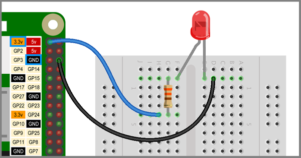

## Lighting an LED

One powerful feature of the Raspberry Pi is the rows of GPIO pins along the top edge of the board. GPIO stands for General-Purpose Input/Output. You can code these pins as switches that you can turn on or off (input) or that the Pi can turn on or off (output).

You can buy a [pin guide](https://thepihut.com/products/gpio-reference-board-model-b-plus-and-a-plus?ref=isp_rel_prd&isp_ref_pos=5){:target="_blank"} to help you identify the GPIO pins, use the image below, or open a terminal and type `pinout` to see the numbers of all the pins.

Before you get using a switchable I/O (input/output) pin, you're going to light an LED by making a simple circuit using a 3.3v pin to supply the power.

This will make sure you know:
+ That your LED and resistor work
+ What a simple LED circuit looks like
+ How to connect the components together

A very simple LED circuit would be an LED connected to a battery cell with a resistor to protect the LED by limiting the current flow.

NOTE: The positive always connects to the longer, positive leg of the LED which is called the **anode**.

You will be using a breadboard to help connect the electronic components together. The image below shows the same circuit using a breadboard.

The breadboard holes are conncted in lines underneath the cover so that:
+ the blue wire connects to the resistor
+ the resistor connects to the **anode** (long, positive leg) of the LED
+ the **cathode** (shorter, negative leg) of the LED connects to the black wire

You are going to make this same circuit but using the Raspberry Pi in place of a battery.

--- task ---

Connect your LED and resistor to the breadboard and then to Raspberry Pi as shown below.

--- /task ---
