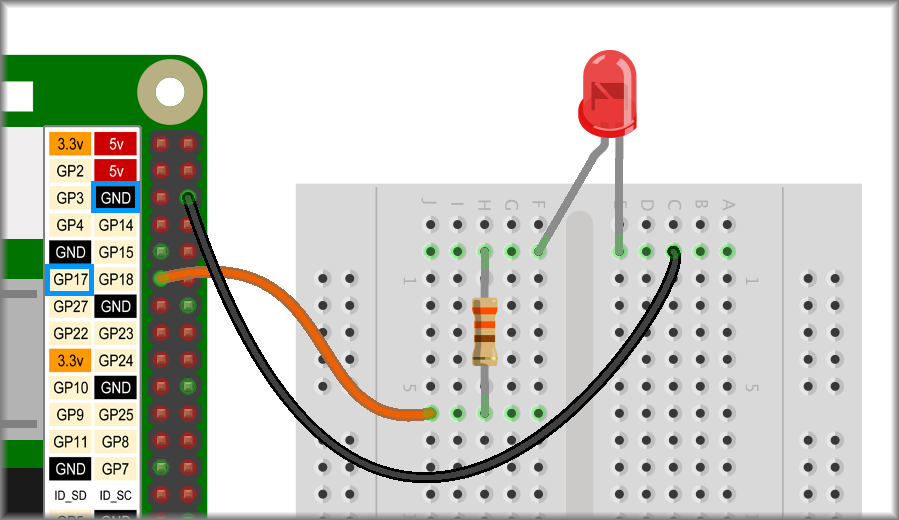
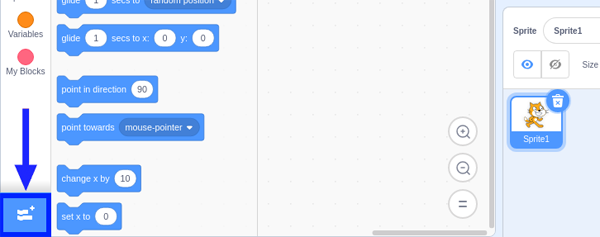
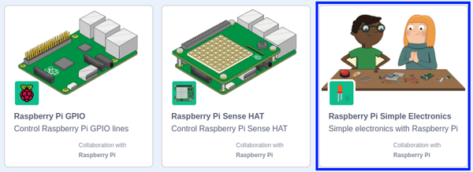
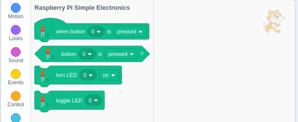

## Coding an LED using an GPIO pin

Now you are going to start using the power of the GPIO pins to control the lighting of the LED. 

--- task ---

Move the jumper cable conencted to the **3.3v** pin on the Pi to GPIO pin 17 as shown below.



--- /task ---

The LED should not be lit as you have not turned the pin on yet. If it is lit, that's not a problem as you will soon learn how to turn it off.

Now you are going to write code in Scratch to control the LED.

--- task ---

Open up Scratch 3 from your Raspberry Pi menu.


--- /task ---

To control the LED using the GPIO pin you will need to add a Scratch extension.

--- task ---

Click on the **Add Extension** button on the bottom left corner.



Scroll down to the bottom to find three Raspberry Pi extensions.



Choose the **Raspberry Pi Simple Electronics** extension. When you click this, a new palette of coding blocks becomes available.



--- /task ---

--- task ---

Choose an **event** to start your code such as `when flag clicked`{:class="block3events"}

```blocks3
when flag clicked
```

--- /task ---

--- task ---

From the Raspberry Pi Simple Electronics pallette, add `turn LED 17 on`{:class="block3extension"}

```blocks3
when flag clicked
+ turn LED (17 v) [on v] ::extension
```

Click the green flag and your LED should light up.

--- /task ---

Now let's turn it on and off.

--- task ---

Add a `wait`{:class="block3control"} block followed by `turn LED 17 off`{:class="block3operators"}.

```blocks3
when flag clicked
turn LED (17 v) [on v] ::extension
+ wait (1) secs
+ turn LED (17 v) [off v] ::extension
```

Click the green flag and your LED should turn on and then turn off again after 1 second.

--- /task ---

Now, it is just a small leap to make your LED flash. Can you already see how?

--- task ---

Add another `wait`{:class="block3control"} block after the `turn LED 17 off`{:class="block3operators"} and put the whole sequence in a `repeat`{:class="block3control"} loop.

```blocks3
when flag clicked
+ repeat (10) times
    turn LED (17 v) [on v] ::extension
    wait (1) secs
    turn LED (17 v) [off v] ::extension
+   wait (1) secs
end
```

Click the green flag and your LED should flash, turing on and off again ten times.

--- /task ---

Play around with the `wait`{:class="block3control"} times? Try having a different `wait`{:class="block3control"} time after turning on or off. Try replacing the `repeat`{:class="block3control"} loop with a `forever`{:class="block3control"} loop.
