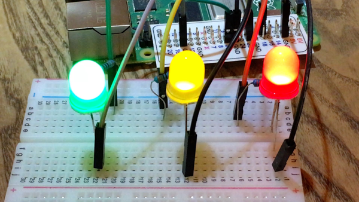
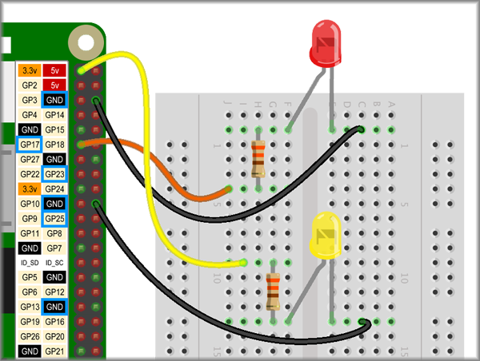

## Challenge: Light show!

Add more LEDs to your breadboard, connect them to your Pi and code a spectacular light show!

--- no-print ---

--- /no-print ---

--- print-only ---

--- /print-only ---

Add new LEDs in the same way that you added the first one.

--- task ---

Connect another LED using the **3.3v** GPIO pin.

--- /task ---

--- task ---

If the LED turns on then you know it is working and connected the correct way round, so move the jumper cable from the **3.3v** pin to a numbered GPIO pin.

--- /task ---

--- hints ---

--- hint ---

When the `program starts`{:class="crumblebasic"}, it should `wait`{:class="crumblecontrol"} a couple of seconds and then turn both motors `FORWARD`{:class="crumbleinputoutput"}, then `wait`{:class="crumblecontrol"} until the buggy has travelled about 30cm. Then, the motors should turn right until they have turned 180° (a half turn), then both motors should turn `FORWARD`{:class="crumbleinputoutput"} until the buggy is back in its starting position. Then, both motors should `STOP`{:class="crumbleinputoutput"}.

--- /hint ---

--- hint ---

You will need to use the blocks below to create the 'there and back again' code.

Can you rearrange them and alter the wait times to make the code work?

--- /hint ---

--- hint ---

The code below works for the example buggy. You might need to alter the wait times and speeds for your buggy.

Click the green **Play** button to see if it works.

--- /hint ---

--- /hints ---
