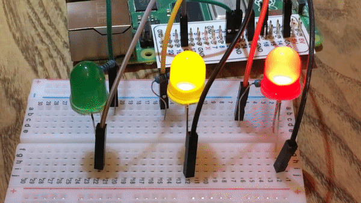
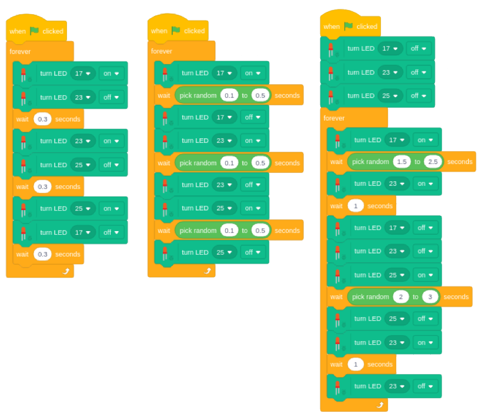
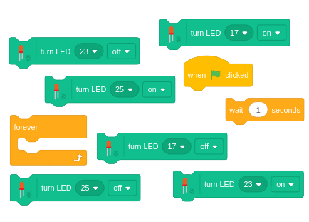

## Challenge: Light show!

Add more LEDs to your breadboard, connect them to your Pi and code a spectacular light show!

--- no-print ---

--- /no-print ---

--- print-only ---

--- /print-only ---

Add new LEDs in the same way that you added the first one.

--- task ---

Connect another LED using the **3.3v** GPIO pin.

--- /task ---

--- task ---

If the LED turns on then you know it is working and connected the correct way round, so move the jumper cable from the **3.3v** pin to a numbered GPIO pin.

--- /task ---

--- task ---

Do the same to add a third LED, and even a fourth if you like.

--- /task ---

With the three LEDs wired up and ready to go it's time for you to write some code to get all the lights working in any way that you like.

The example shows the LEDs connected to GPIO pins 17, 23 and 25 but you could use any pins that you like, just make sure your coding uses the same pins that you have used.

--- hints ---

--- hint ---

`when flag clicked`{:class="block3events"}, carry on `forever`{:class="block3control"} turning `LED 17`{:class="block3extension"}, `LED 23`{:class="block3extension"} and `LED 25`{:class="block3extension"} `on and off`{:class="block3extension"}.

This challenge is very open, the order you light them, whether they all go together or on some random sequence, how you set the timing are all up to you.

--- /hint ---

--- hint ---

You will probably use the blocks below to create the LED light show code.

You might also want to use the `random number`{:class="block3operators"} block.

--- /hint ---

--- hint ---

The code below are some possible examples but what you come up with is up to you. You might want to think about the result you want and try to make that heppen with code, or you could approach it from the other side, playing with the code and seeing what the results look like. 

Always try and understand why the result look the way it does. 

--- /hint ---

--- /hints ---
