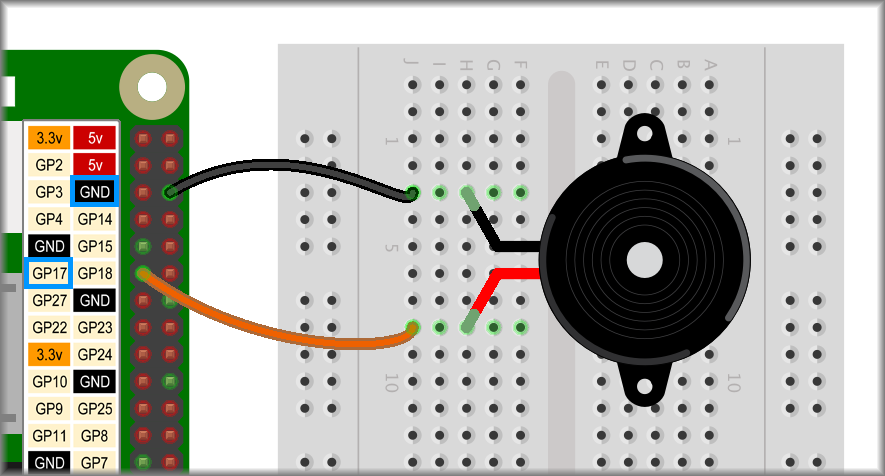

## Making noise with buzzers

As well as LEDs, you can control other electronic components using Scratch 3 on the Raspberry Pi.

Although the `Simple Electronics`{:class="block3extensions"} blocks that you have used so far refer to `turning LEDs on or off`{:class="block3extensions"}, all they are doing is switching the GPIO pin on or off (high or low). We could use them to control other electronic components too but just to make things clear, let's add another Scratch extension.

--- task ---
Add the `Raspberry Pi GPIO` extension in Scratch 3


--- /task ---

### Connecting a buzzer

A buzzer can be connected just like an LED, but as they are a little more robust, you won't be needing a resistor to protect them.

Just like the LED, many buzzers need to have the positive power supply going to the longer, positive leg to work.

Set up your buzzer circuit as shown below:



### Coding a buzzer

Just as you turned your LED connected to GPIO 17 on by `turning LED 17 on`{:class="block3extensions"}, now you can turn your buzzer on by `setting GPIO 17 to output high`{:class="block3extensions"}.

+ output high = on
+ output low = off

--- task ---
Now you can make a really annoying intermittent screeching noise by `looping`{:class="block3control"} `GPIO 17 high`{:class="block3extensions"},`wait`{:class="block3control"} `GPIO 17 low`{:class="block3extensions"} and another `wait`{:class="block3control"}.

```blocks3
when flag clicked
forever
set gpio (17 v) to output [high v] ::extension
wait (1) secs
set gpio (17 v) to output [low v] ::extension
wait (1) secs
```

--- /task ---

You can get creative too and play around with the timing, make screechy beats or even randomise the wait times.

--- task ---
Play around with the `wait`{:class="block3control"} times to find a **noise** sequence you like!

Here is my favourite screechy beat:

```blocks3
when flag clicked
forever
    repeat (4) times
        set gpio (17 v) to output [high v] ::extension
        wait (0.05) secs
        set gpio (17 v) to output [low v] ::extension
        wait (pick random (0.1) to (0.2)) secs
    end
    set gpio (17 v) to output [high v] ::extension
    wait (0.6) secs
    set gpio (17 v) to output [low v] ::extension
    wait (0.2) secs
    set gpio (17 v) to output [high v] ::extension
    wait (0.3) secs
    set gpio (17 v) to output [low v] ::extension
    wait (0.2) secs
end
```

--- /task ---
