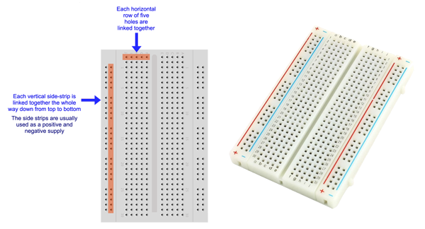
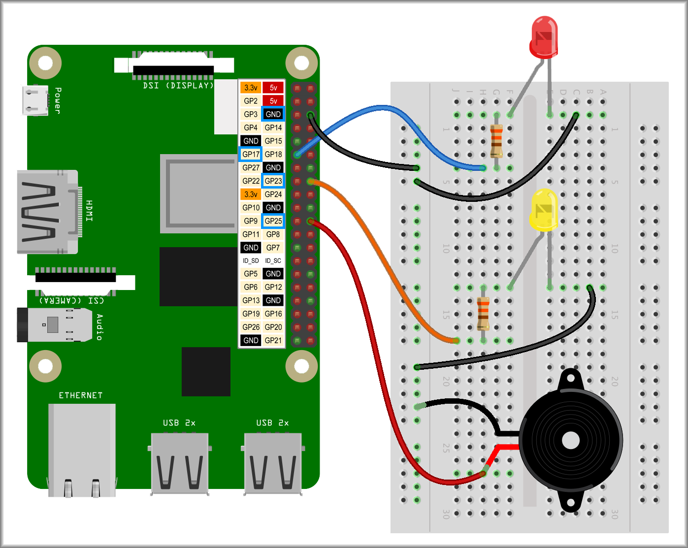

## Coding sequences

Now you know how to wire up LEDs and buzzers, it is about time we mashed them up together. First let's look at something new about breadboards...

### Breadboard side positive and negative strips

You have been using the horizontal rows of five holes that join your components together but there is also a pair of vertical side strips that are often marked as positive (+) and negative (-) and are usually used to create a positive and negative strip all the way down the side of your breadboard. 



Since we are using switched GPIO pins, we have little use for a positive strip but a negative strip connected to the Raspberry Pi ground makes a lot of sense.

### Wriring up

--- task ---

Wire up a couple of LEDs to GPIO 17 and 23, and a buzzer to GPIO 25. Link the negative side strip to the Raspberry Pi ground (GND) pin and take all negative feeds from there.



--- /task ---

### Sequence 1

--- task ---

If you saved the Scratch code from the **light show challenge**, that will work with this new set up as long as you used GPIO pins 17, 23 and 25. You will have code that says, `turn LED 25 on`{:class="block3extensions"} or `off`{:class="block3extensions"} but all that does is `set GPIO pin 25 to output high`{:class="block3extensions"} (on) or `low`{:class="block3extensions"} (off), so it will work just the same for an LED or a buzzer.

Open your code and see how it looks... and sounds!

--- /task ---

Just so our code is clear, we'll use the Simple Electronics `LED`{:class="block3extensions"} blocks for our LEDs and the GPIO `set gpio`{:class="block3extensions"} blocks for other components.

Time to make a sequence specially for our new two LED and single buzzer set up.

There is no problem with making a single sequence where the LEDs and buzzer are controlled together but here is a sequence where they run side by side. This is useful if you are happy for the LEDs to saty on for a while but would like the buzzer to be quiet as quickly as possible!

--- task ---

Write the code for the LEDs starting with the `green flag`{:class="block3events"} and a `forever`{:class="block3control"} loop.

It does not matter at all if you choose diferent timings to mine.

```blocks3
when flag clicked
forever
    turn LED (17 v) [on v] ::extension
    wait (pick random (0.2) to (1)) secs
    turn LED (17 v) [off v] ::extension
    turn LED (23 v) [on v] ::extension
    wait (pick random (0.3) to (1.5)) secs
    turn LED (23 v) [off v] ::extension
end
```

--- /task ---

--- task ---

Now write the code for the buzzer, again starting with the `green flag`{:class="block3events"} and a `forever`{:class="block3control"} loop.

```blocks3
when flag clicked
forever
    set gpio (25 v) to output [high v] ::extension
    wait (pick random (0.05) to (0.25)) secs
    set gpio (25 v) to output [low v] ::extension
    wait (0.03) secs
    set gpio (25 v) to output [high v] ::extension
    wait (pick random (0.05) to (0.25)) secs
    set gpio (25 v) to output [low v] ::extension
    wait (pick random (0.7) to (1.5)) secs
end
```
NOTE: In this example the buzzer has a double beep (turns off for just 0.03 seconds) but only stays on for a short time before staying off for much longer.

--- /task ---

Let's add a new GPIO control block.

--- task ---

The code below uses a new event block from the `Raspberry Pi GPIO` extension which says, `when gpio 25 is high`{:class="block3extensions"}.

Any code below this block will **run** whenever `GPIO 25 is high`{:class="block3extensions"}, i.e. whenever the buzzer is on.

```blocks3
when gpio (25 v) is [high v] ::hat extension
turn LED (23 v) [on v] ::extension
turn LED (17 v) [off v] ::extension
```

Add this code to your project.

Can you see what it will do?

--- /task ---

The new piece of code forces `LED 23`{:class="block3extensions"} to be **on** and `LED 17`{:class="block3extensions"} to be **off whenever the buzzer sounds. 

--- task ---

Have a play in Scratch and make up you own sequences. You can add more LEDs and buzzers if you like.

--- /task ---

