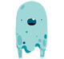

## Scratch, sound and lights

Up till now, all your Scratch coding has been to make the LEDs and buzzer turn on and off. Now you're going to mix things up a little and code have your LEDs and buzzer interacting with sprites on your Scratch stage.

First, you'll code a simple straight link between each component (LED or buzzer) and a sprite, e.g.
+ **GPIO pin 17** linked with the **dinosaur 2** sprite
+ **GPIO pin 23** linked with the **Frank** sprite
+ **GPIO pin 25** linked with the **ghost** sprite

The example is using the same wiring setup as before with two LEDs and a buzzer but you can switch things around if you like.

Let's start with dinosaur 2.

--- task ---

Create a new sprite. This example uses dinosaur 2 but you can pick something different if you like. I chose the dinosaur 2 sprite because it is red like the LED.


--- /task ---

--- task ---

Code the **starting state** for the dinosaur 2 sprite. This **initialises** the sprite so that it starts in the right place, is the right size, the right colour, etc.

We'll start with the `green flag`{:class="block3events"} event and a block telling the sprite where to be on the stage.


```blocks3
when flag clicked
go to x: (-120) y: (0)
```

--- /task ---

--- task ---

Add code to make the LED turn on and turn off.


```blocks3
when flag clicked
go to x: (-120) y: (0)
+ forever
    turn LED (17 v) [on v] ::extension
    wait (pick random (1) to (2)) secs
    turn LED (17 v) [off v] ::extension
    wait (pick random (1) to (2)) secs
end
```

--- /task ---

--- task ---

Next, add code to make the something happen to the dinosaur sprite at whenever the LED lights.


```blocks3
when flag clicked
go to x: (-120) y: (0)
forever
    turn LED (17 v) [on v] ::extension
+   change size by (30)
    wait (pick random (1) to (2)) secs
    turn LED (17 v) [off v] ::extension
    wait (pick random (1) to (2)) secs
end
```
Run your code and see what happens.

--- /task ---

Your dinosaur should grow a little each time the red LED lights up. 

Unfortunately, the dinosaur just gets bigger and bigger until it dominates the screen!

We need to add two bits of code to fix this:
+ add `set size to 100%`{:class="block3looks"} to the starting state at the beginning
+ add another `set size to 100%`{:class="block3looks"} block whenever the LED turns off

--- task ---

Add code to make the dinosaur start at normal size and go back to normal size when the LED goes out.


```blocks3
when flag clicked
go to x: (-120) y: (0)
+ set size to (100) %
forever
    turn LED (17 v) [on v] ::extension
    change size by (30)
    wait (pick random (1) to (2)) secs
    turn LED (17 v) [off v] ::extension
+   set size to (100) %
    wait (pick random (1) to (2)) secs
end
```

Run your code again to check that the dinosaur always returns to normal size.

--- /task ---

Time to code the Frank sprite for LED 23.

--- task ---

Create a new sprite for Frank and add starter code like you did for the dinosaur. This time you know to add a line to make Frank start at normal size.


```blocks3
when flag clicked
go to x: (0) y: (0)
set size to (100) %
```

--- /task ---

--- task ---

Add code to make LED 23 turn on and off.


```blocks3
when flag clicked
go to x: (0) y: (0)
set size to (100) %
+ forever
    turn LED (23 v) [on v] ::extension
    wait (pick random (0.3) to (1.2)) secs
    turn LED (23 v) [off v] ::extension
    wait (pick random (0.3) to (1.2)) secs
end
```

--- /task ---

--- task ---

Now add code to make Frank grow and shrink as the LED turns on and off.


```blocks3
when flag clicked
go to x: (0) y: (0)
set size to (100) %
forever
    turn LED (23 v) [on v] ::extension
+   change size by (30)
    wait (pick random (0.3) to (1.2)) secs
    turn LED (23 v) [off v] ::extension
+   set size to (100) %
    wait (pick random (0.3) to (1.2)) secs
end
```

--- /task ---

--- task ---

How about adding a new effect?

Remember that whatever effect you add when the LED turns **on**, you ususally want to reverse when the LED turn **off** and add a starting state block so that the sprite starts off in the right place, the right colour, etc.

Have a go at adding a **whirl** effect


```blocks3
when flag clicked
go to x: (0) y: (0)
set size to (100) %
+ set [whirl] effect to (0)
forever
    turn LED (23 v) [on v] ::extension
    change size by (30)
+   change [whirl v] effect by (200)
    wait (pick random (0.3) to (1.2)) secs
    turn LED (23 v) [off v] ::extension
    set size to (100) %
+   set [whirl] effect to (0)
    wait (pick random (0.3) to (1.2)) secs
end
```

Run your code to see Frank whirl and grow!

--- /task ---

It's good to regularly test what your code is doing and see that everything is doing what you want as you go along. I have noticed that in this example, the dinosaur and Frank are too large for the screen and get in each other's way.

--- task ---

Reduce the **normal** size for both sprites, both in the starting state and when the LEDs turn off.

```blocks3
set size to (60) %
```
Run your code and see if the new sizes are an improvement. Do you want the sprites to be larger or smaller?

--- /task ---

Now let's move on to the ghost buzzer sprite.

--- task ---

Add a ghost sprite and starting code.



```blocks3
when flag clicked
go to x: (120) y: (0)
set size to (60) %
```

NOTE: Your starting state code will usually reflect what is going to happen in your code. If you are not planning to change the **whirl** effect then there is no need to `set the whirl effect`{:class="block3looks"} at the start.

--- /task ---

--- task ---

Add code to turn the buzzer on and off using the **GPIO** extension blocks and change the size.


```blocks3
when flag clicked
go to x: (120) y: (0)
set size to (60) %
+ forever
    set gpio (25 v) to output [high v] ::extension
    change size by (30)
    wait (pick random (0.03) to (0.3)) secs
    set gpio (25 v) to output [low v] ::extension
    set size to (100) %
    wait (pick random (0.5) to (1.5)) secs
end
```

--- /task ---

This time, let's try adding a costume change. Remember to add code to tell the ghost sprite which costume to start off in.

--- task ---

This time, let's try adding a costume change. Remember to add code to tell the ghost sprite which costume to start off in.


```blocks3
when flag clicked
go to x: (120) y: (0)
set size to (60) %
+   switch costume to (ghost-a v)
forever
    set gpio (25 v) to output [high v] ::extension
    change size by (30)
+   switch costume to (ghost-c v)
    wait (pick random (0.03) to (0.3)) secs
    set gpio (25 v) to output [low v] ::extension
    set size to (100) %
+   switch costume to (ghost-a v)
    wait (pick random (0.5) to (1.5)) secs
end
```

Run your code.

--- /task ---

You may have noticed that if you stop your code while the buzzer is turned on, the buzzer stays on and screeches until you turn the Pi off or restart the code.

Let's add a separate code snippet to let you turn the buzzer and LEDs off.

--- task ---

Add the code below as a separate script.

In this example, the code is added to the ghost sprite but it would work the same wherever you add it.


```blocks3
when [space v] key pressed
set gpio (25 v) to output [low v] ::extension
turn LED (17 v) [off v] ::extension
turn LED (23 v) [off v] ::extension
```

Run your code, stop the code and then press **SPACE** to check that it works.

--- /task ---

--- task ---

Before we move on to the next section, have a go at adding more effects or changes.

Play!

```blocks3
say (Hello!) for (0.5) seconds

set [ghost v] effect to (100)

change [color v] effect by (75)

turn cw (45) degrees

go to (random position v)
```

Can you make the background change if both LEDs and the buzzer are on at the same time?

--- /task ---