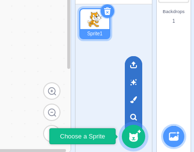

## Scratch, sound and lights

Up till now, all your Scratch coding has been to make the LEDs and buzzer turn on and off. Now you're going to mix things up a little and code have your LEDs and buzzer interacting with sprites on your Scratch stage.

First, you'll code a simple straight link between each component (LED or buzzer) and a sprite, e.g.
+ **LED 17** linked with the **dinosaur 2** sprite
+ **LED 23** linked with the **Frank** sprite
+ **LED 25** linked with the **ghost** sprite

Let's start with dinosaur 2.

--- task ---

Create a new sprite. This example uses dinosaur 2 but you can pick something different if you like. I chose the dinosaur 2 sprite because it is red like the LED.



--- /task ---

--- task ---

Code the **starting state** for the dinosaur 2 sprite. This **initialises** the sprite so that it starts in the right place, is the right size, the right colour, etc.


```blocks3
when flag clicked
go to x: (-120) y: (0)
```

--- /task ---