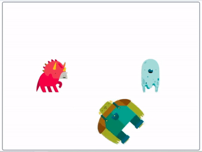

## Scratch, sound and lights interactive

The code you have just written for the dinosaur, Frank and the ghost (other sprites available) consists of three main elements

+ an **event**: the green flag
+ **initialisation**: setting the startting state, e.g. where, what size, starting effect values, etc.
+ **forever loop**: cycle of changes - LED control, effect changes and wait times

Once the cycle of changes start, that's it. The changes keep on going `forever`{:class="block3control"} automatically.

Now you are going to edit your code to make it more interactive. Instead of changes taking place in a set cycle, the changes will only take place when you click on the sprite.

--- task ---

Click on the **Frank** sprite (the process is the same for all sprites so would work for any you choose).

Now pull the code into two parts.
+ the `event`{:class="block3events"} and starting state (initialisation)
+ the cycle of changes (the `forever`{:class="block3control"} loop and everything inside it)


```blocks3
when flag clicked
go to x: (0) y: (0)
set size to (100) %
set [whirl] effect to (0)

forever
    turn LED (23 v) [on v] ::extension
    change size by (30)
    change [whirl v] effect by (200)
    wait (pick random (0.3) to (1.2)) secs
    turn LED (23 v) [off v] ::extension
    set size to (100) %
    set [whirl] effect to (0)
    wait (pick random (0.3) to (1.2)) secs
end
```

--- /task ---

--- task ---

Next, pull the changes code out of the `forever`{:class="block3control"} loop and throw the `forever`{:class="block3control"} block away.


```blocks3
turn LED (23 v) [on v] ::extension
change size by (30)
change [whirl v] effect by (200)
wait (pick random (0.3) to (1.2)) secs
turn LED (23 v) [off v] ::extension
set size to (100) %
set [whirl] effect to (0)
wait (pick random (0.3) to (1.2)) secs
```

--- /task ---

--- task ---

Now you just need to give the changes a new `event`{:class="block3events"} to set them in motion.

Grab a `when this sprite clicked block`{:class="block3events"} from the `event`{:class="block3events"} palette, and place it at the start of the changes script.


```blocks3
when this sprite clicked
turn LED (23 v) [on v] ::extension
change size by (30)
change [whirl v] effect by (200)
wait (pick random (0.3) to (1.2)) secs
turn LED (23 v) [off v] ::extension
set size to (100) %
set [whirl] effect to (0)
wait (pick random (0.3) to (1.2)) secs
```

Click on the Frank sprite to see the changes happen. 

Of course the changes only happen in one cycle now because we are not using the `forever`{:class="block3control"} loop, but they will happen every time you click on Frank.

--- /task ---

--- task ---

Repeat these simpe steps for your other sprites.

Click on each one to see them change.

--- /task ---

How about turning this more interacive program into a fun little challenge?

Try and click on all three sprites so they are all going through their changes and back again at the same time.

You've got to be quick but it's a bit too easy when the sprites are sitting still.

Let's add more code to get the sprites moving around to makes things a little trickier!

--- task ---

Starting with the **Frank** sprite again, you're going to add a movement section to the code.

You want Frank to keep on moving so start with a `forever`{:class="block3control"} loop block.

Inside the `forever`{:class="block3control"} loop, place a `move 10 steps`{:class="block3motion"} block and a `turn clockwise 15 degrees`{:class="block3motion"} block.


```blocks3
forever
    move (10) steps
    turn cw (15) degrees
end
```

--- /task ---

--- task ---

Add another `move 10 steps`{:class="block3motion"} block and a `turn counter-clockwise 15 degrees`{:class="block3motion"} block to make Frank turn the other way this time.

Finally, to stop Frank getting stuck at the sides of the screen, add an `if on edge, bounce`{:class="block3motion"} block.


```blocks3
forever
    move (10) steps
    turn cw (15) degrees
    move (10) steps
    turn ccw (15) degrees
    if on edge, bounce
end
```

Click on the green flag to see how Frank moves.

--- /task ---

Well, he is moving but it's a little predictable.

--- task ---

making the `turn`{:class="block3motion"} values different from each other makes a big difference to how your sprites move but have a play around with each of the values until you find a motion that you like.


```blocks3
forever
    move (6) steps
    turn cw (6) degrees
    move (10) steps
    turn ccw (7) degrees
    if on edge, bounce
end
```

--- no-print ---



--- /no-print ---

--- /task ---