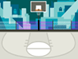

## Scratch games with LEDs and buzzers

The last thing you're going to do in this project is make a two-player Scratch game.

The game will be a simple race game but the players can only move at certain times indicated by two LEDs and a buzzer. If a player tries to move when the red LED is lit, they will jump backwards!

--- no-print ---


--- /no-print ---

--- print-only ---


--- /print-only ---

Let's start with the LED and buzzer hardware circuits.

--- task ---

You'll need to start off with a red LED wired to GPIO 17, a yellow LED wired to GPIO 23 and a buzzer wired to GPIO 25. Of course, it makes no difference if you choose different colours or different GPIO pin numbers but the example code will always refer to these pin numbers.


This is the exact same setup you had earlier in **Coding sequences**.

--- /task ---

Next step is to get a **backdrop** and two **sprites**.

--- task ---

Click on the **choose a backdrop** button and choose a background that works for two characters to race across. 


This example uses **Basketball 1**.


--- /task ---

--- task ---

Next, click on the **choose a sprite** button and choose two sprites to race across your stage. Having two characters that are similar widths will make things easier but using sprites you like is important too.


This example uses **Ben** and **Jordyn**. They are very similar which makes things easier.


--- /task ---

### The game structure

+ To make your player move, you simply have to press that sprite's **move** key, **a** for Ben and **l** for Jordyn. The letters at opposite ends of the keyboard.
+ The red LED indicates that you are not allowed to move. If a player has their **move** button pressed when the red light is lit, their sprite will jump backwards.
+ The yellow LED indicates that you **are** allowed to move. Pressing a player's **move** light when the yellow LED is lit will make their sprite move slowly forwards.
+ The buzzer will sound as a warning just before the yellow turns off and the red LED turns on. As soon as a player hears the buzzer they should stop pressing their **move** button.

You will write the code for when the LEDs and buzzer turn on and off in the stage's workspace.

--- task ---

For this project, you will need both the `Raspberry Pi GPIO` and `Raspberry Pi Simple Electronics` extensions, so add those right away if they are not already loaded.

--- /task ---

--- task ---

Select the stage.

Start wth the `when flag clicked`{:class="block3events"} and then add blocks to make sure that the yellow LED and buzzer start by being off, and the red LED starts on.

+ red LED = LED 17
+ yellow LED = LED 23
+ buzzer = GPIO 25



```blocks3
when flag clicked
set gpio (25 v) to output [low v] ::extension
turn LED (23 v) [off v] ::extension
turn LED (17 v) [on v] ::extension
```

--- /task ---

--- task ---

Add a short `wait`{:class="block3control"}. Best to make this `pause`{:class="block3control"} before the game begins `random`{:class="block3operators"} so that nobody can be sure when the game will start!


```blocks3
wait (pick random (1.5) to (5.5)) seconds
```

--- /task ---

The next section of code is the repeating loop:
+ yellow LED `on`{:class="block3extensions"}, red LED `off`{:class="block3extensions"}
+ random wait
+ buzzer `on`{:class="block3extensions"}
+ wait 0.1 seconds
+ yellow LED `off`{:class="block3extensions"}, red LED `on`{:class="block3extensions"},buzzer `off`{:class="block3extensions"}
+ random wait

--- task ---

Grab a `forever`{:class="block3control"} loop and add the blocks turning the LEDs and buzzer `on`{:class="block3extensions"} and `off`{:class="block3extensions"}.


```blocks3
when flag clicked
set gpio (25 v) to output [low v] ::extension
turn LED (23 v) [off v] ::extension
turn LED (17 v) [on v] ::extension
wait (pick random (1.5) to (5.5)) seconds

+ forever
    turn LED (17 v) [off v] ::extension
    turn LED (23 v) [on v] ::extension
    wait (pick random (1.5) to (5.5)) seconds
    set gpio (25 v) to output [high v] ::extension   
    wait (0.1) seconds
    turn LED (23 v) [off v] ::extension
    turn LED (17 v) [on v] ::extension
    set gpio (25 v) to output [low v] ::extension
    wait (pick random (1.5) to (5.5)) seconds
end
```

Connect your new `forever`{:class="block3control"} loop code to your existing code that starts with the `when flag clicked`{:class="block3events"} event.

Click the green flag to check that your LEDs and buzzers work as expected:

+ red LED **on** - yellow LED **off**
+ yellow LED **on** - red LED **off**
+ buzzer sounds for an instant
+ back to red LED **on** - yellow LED **off**
+ and so on...

The red and yellow LEDs should never be on at the same time.

--- /task ---