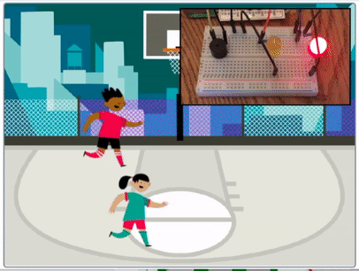
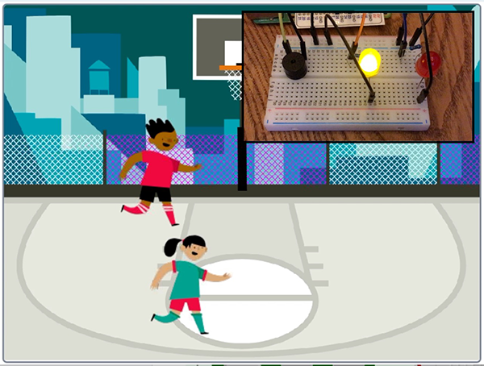
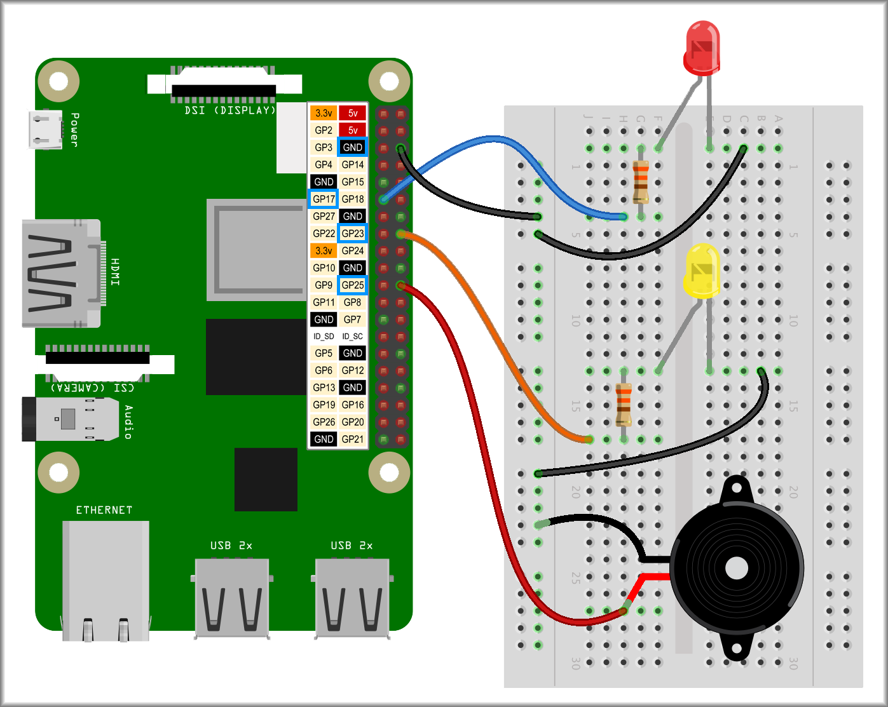
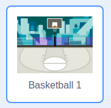
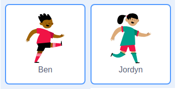

## Scratch games with LEDs and buzzers

The last thing you're going to do in this project is make a two-player Scratch game.

The game will be a simple race game but the players can only move at certain times indicated by two LEDs and a buzzer. If a player tries to move when the red LED is lit, they will jump backwards!

--- no-print ---

--- /no-print ---

--- print-only ---

--- /print-only ---

Let's start with the LED and buzzer hardware circuits.

--- task ---

You'll need to start off with a red LED wired to GPIO 17, a yellow LED wired to GPIO 23 and a buzzer wired to GPIO 25. Of course, it makes no difference if you choose different colours or different GPIO pin numbers but the example code will always refer to these pin numbers.

This is the exact same setup you had earlier in **Coding sequences**.

--- /task ---

Next step is to get a **backdrop** and two **sprites**.

--- task ---

Click on the **choose a backdrop** button and choose a background that works for two characters to race across. 

This example uses **Basketball 1**.

--- /task ---

--- task ---

Next, click on the **choose a sprite** button and choose two sprites to race across your stage. Having two characters that are similar widths will make things easier but using sprites you like is important too.

This example uses **Ben** and **Jordyn**. They are very similar which makes things easier.

--- /task ---